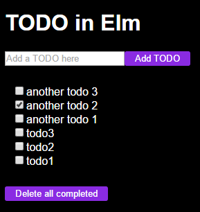

# TODO app in Elm

A TODO app that allows you to list, add, mark as completed and delete all completed items.



I've decided to make it my way: with my own CSS and HTML.
From there I started to learn Elm. It was a little adventure! :)
Things like fetching data from an api or sending data to the api, parsing or encoding the json response/request took me some time.
But after you pass these things and learn the Elm way of doing everything you need: you can feel its power!

I used a RESTful API using GET/POST/PUT/DELETE with a local JSON server.
The JSON server makes everything for you but I also needed to add the end point:
DELETE /todos/completed to handle this one too.

In this app you will see:
- how to handle Http requests using JSON decoders, Tasks and Messages
- how to handle errors gracefully
- how to do a couple of things one by one or simultaneously
- how to use a separate component/package (Todos)
- how to use json-server and lowdb for more sofisticated responses
and many more!

# Install

Open a console, go to the app's root dir and run:

```bash
elm package install && npm install
```

# Configure

Copy `db.json_sample` to `db.json`. You may also populate it with some sample values but this is optional.


# Run

First start the API:

```bash
npm run api
```

Then the webpack dev web server:

```bash
npm run dev
```

Go to [http://localhost:3000/](http://localhost:3000/) to see the application running.

# Build for production

Run the following command:

```bash
npm run build
```

This will create a `build/` directory in the root of the app from where you can get all the files you need to put on a server to run the application.
